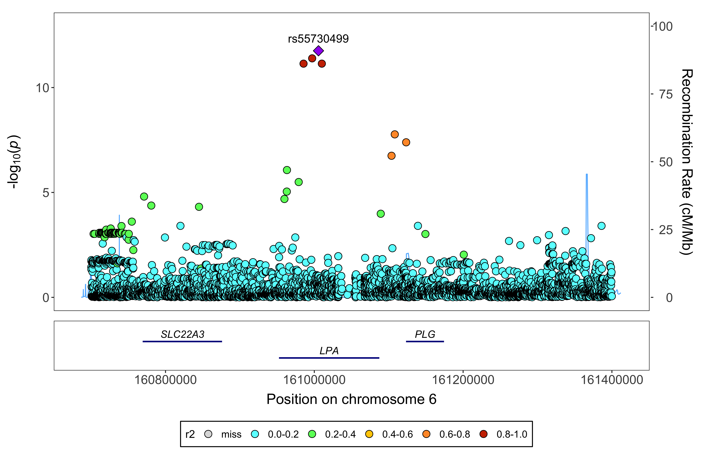
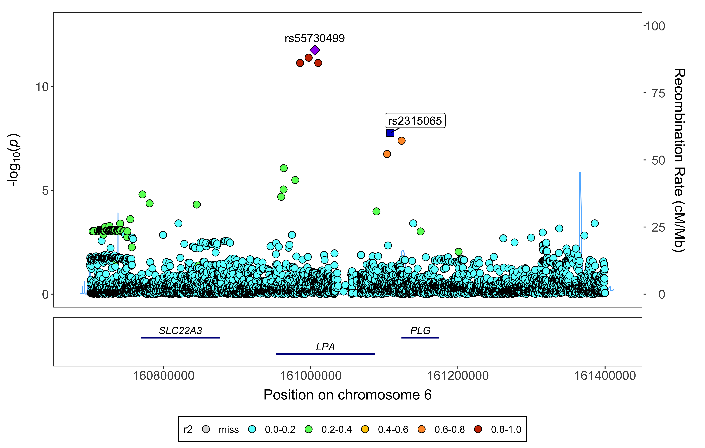
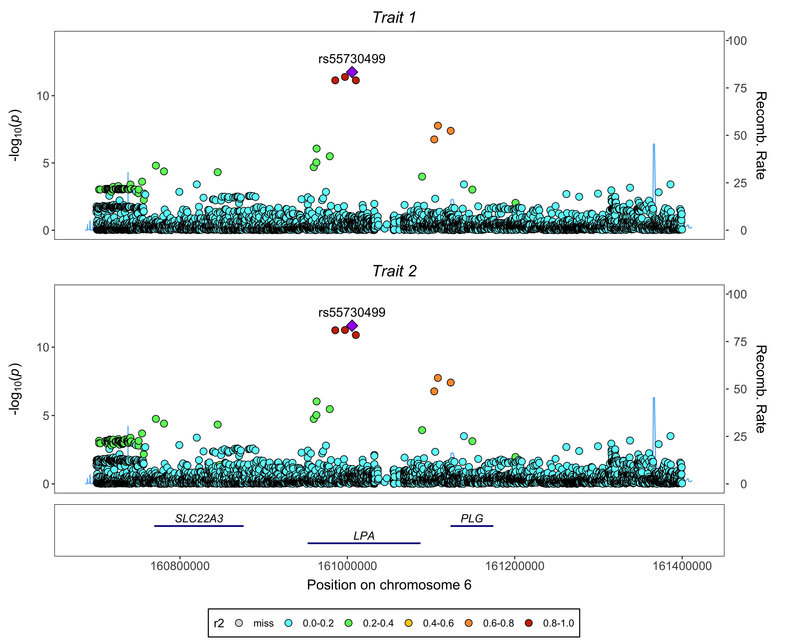

# GENI plots 
`gassocplot2` is no longer maintained, please use `fig_region` and `fig_region_stack` in `geni.plots` instead. `geni.plots` is available [here](https://github.com/jrs95/geni.plots/).  

<!--
# gassocplot2 
Regional association plots for genetic and epigenetic data.

## Functions
* `assoc_plot`: plots a regional association plot or fine-mapping probability plot for a single trait within a genomic region based on GRCh37 (hg19) or GRCh38 (hg38) coordinates.  
* `assoc_plot_save`: saves a PNG of the assoc_plot.  
* `stack_assoc_plot`: plots a stacked regional association plot for multiple traits within a genomic region based on GRCh37 (hg19) or GRCh38 (hg38) coordinates.  
* `stack_assoc_plot_save`: saves a PNG of the stack_assoc_plot.  

## Installation
```
install.packages("remotes")
remotes::install_github("jrs95/gassocplot2")
```

## Examples
```
# Libraries
library(gassocplot2)

# Association plot
markers <- gassocplot2::test_assoc_plot
head(markers)
corr <- gassocplot2::test_corr # correlation matrix (not correlation squared) ordered in the same way as the markers
plot <- assoc_plot(markers, corr)
assoc_plot_save(plot, "assoc_plot_test.png")
plot <- assoc_plot(markers, corr, label = "rs2315065") # add additional variant label
assoc_plot_save(plot, "assoc_plot_test_add_label.png")

# Stacked association plot
markers <- gassocplot2::test_stack_assoc_plot_markers
head(markers)
z <- gassocplot2::test_stack_assoc_plot_associations
head(z)
corr <- gassocplot2::test_corr # correlation matrix (not correlation squared) ordered in the same way as the markers
plot <- stack_assoc_plot(markers, z, corr, traits = c("Trait 1", "Trait 2"))
stack_assoc_plot_save(plot, "stack_assoc_plot_test.png", 2)
```

## Linkage disequilibrium information
The [LDlinkR](https://cran.r-project.org/web/packages/LDlinkR/index.html) package can be used to obtain linkage disequilibrium matrices from 1000G using the LDmatrix function. Note the matrix from this function would have to be square rooted and ordered in the same way as the markers data frame.  

## Citation
Please cite this R package using the link: https://github.com/jrs95/gassocplot2  

## Plots

### Regional association plot


### Regional association plot with additional label


### Stacked regional association plot

-->
